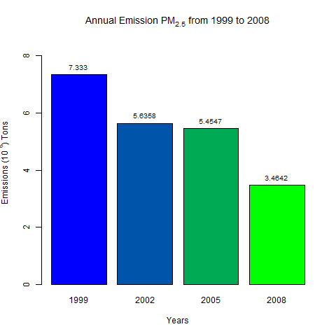
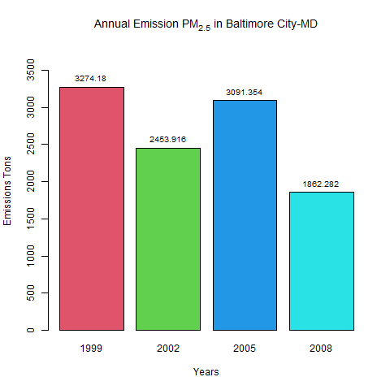
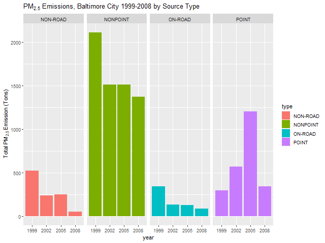
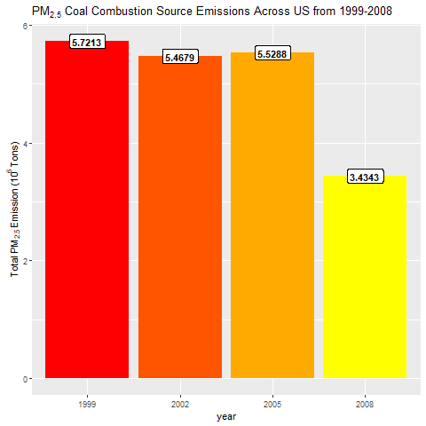
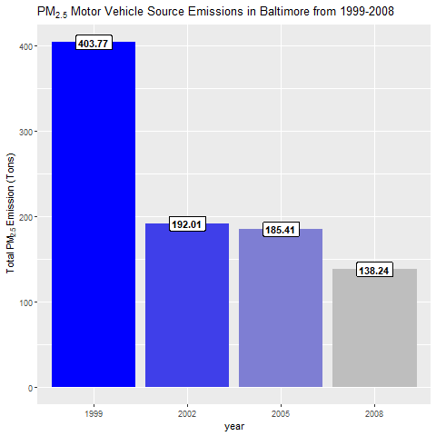
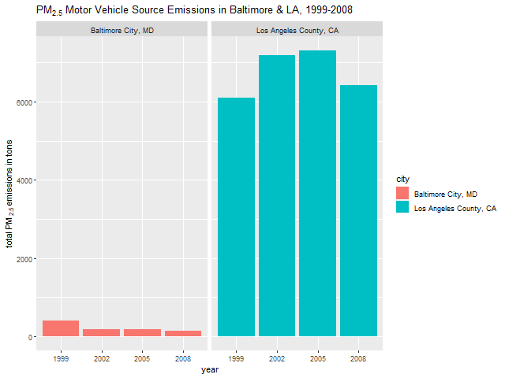

**Sample codes with two projects**
==================================

1.  [Getting-and cleaning
    data](https://github.com/sergiomr04/Exploratory_Data_Analysis_Project2#getting-and-cleaning-data-project "Getting-and cleaning data")  
2.  [Exploratory Data
    Analysis](https://github.com/sergiomr04/Exploratory_Data_Analysis_Project2#exploratory-data-analysis-project "Exploratory Data Analysis")

**Getting and Cleaning Data Project**
=====================================

### Description

This project is part of the Getting and Cleaning Data course from Johns
Hopkins University on Coursera.org.

The purpose of this project is to demonstrate your ability to collect,
work with, and clean a data set. The goal is to prepare tidy data that
can be used for later analysis.

[`run_analysis.R`](run_analysis.R) performs the data preparation and
then followed by the 5 Parts required as described in the course
project’s definition:

### Source Data

One of the most exciting areas in all of data science right now is
wearable computing - see for example this article . Companies like
Fitbit, Nike, and Jawbone Up are racing to develop the most advanced
algorithms to attract new users. The data linked to from the course
website represent data collected from the accelerometers from the
Samsung Galaxy S smartphone. A full description is available at the site
where the data was obtained:

Description can be found here [UCI Machine Learning
Repository](http://archive.ics.uci.edu/ml/datasets/Human+Activity+Recognition+Using+Smartphones)

Here are the data for the project: [Data
Set](https://d396qusza40orc.cloudfront.net/getdata%2Fprojectfiles%2FUCI%20HAR%20Dataset.zip)

### Loading required packages

    library(dplyr)
    library(data.table)

### Downloaded the dataset

    filename <- "Getting_Cleaning_Dataset.zip"
    # Checking if archieve already exists.
    if (!file.exists(filename)){
      fileURL <- "https://d396qusza40orc.cloudfront.net/getdata%2Fprojectfiles%2FUCI%20HAR%20Dataset.zip"
      download.file(fileURL, filename, method="curl")
    }

    # Checking if folder exists
    if (!file.exists("UCI HAR Dataset")) { 
      unzip(filename) 
    }

### Part 1 - Merge the training and the test sets to create one data set

Read .txt files into data frames

-   This project will use six data, which are `x_train.txt`,
    `x_test.txt`, `y_train.txt`, `y_test.txt`, `subject_train.txt` and
    `subject_test.txt`, they can all be found inside the downloaded
    dataset, namely URI HAR Dataset.
-   The \``features.txt` (561 rows, 2 columns) contains the correct
    variable name, which corresponds to each column of `x_train.txt`
    with 7352 rows, 561 columns contains recorded features train data
    and `x_test.txt` with 2947 rows, 561 columns contains recorded
    features test data. Further explanation of each feature is in the
    `features_info.txt`.
-   The `activity_labels.txt` 6 rows, 2 columns List of activities
    performed when the corresponding measurements were taken and its
    codes (labels) which corresponds to each number in the `y_train.txt`
    (7352 rows, 1 columns) and `y_test.txt` (2947 rows, 1 columns).
-   The `README.txt` is the overall desciption about the overall process
    of how publishers of this dataset did the experiment and got the
    data result.

Activity (1 to 6) (WALKING, WALKING\_UPSTAIRS, WALKING\_DOWNSTAIRS,
SITTING, STANDING, LAYING)

    #features and activities labels
    features <- data.table::fread("UCI HAR Dataset/features.txt", col.names = c("n","functions"))
    activities <- data.table::fread("UCI HAR Dataset/activity_labels.txt", col.names = c("code", "activity"))

Subjects group of 30 volunteers

    subject_test <- data.table::fread("UCI HAR Dataset/test/subject_test.txt", col.names = "subject")
    subject_train <- data.table::fread("UCI HAR Dataset/train/subject_train.txt", col.names = "subject")

Data where 70% of the volunteers was selected for generating the
training data and 30% the test data, and Activity (1 to 6)

    x_train <- data.table::fread("UCI HAR Dataset/train/X_train.txt", col.names = features$functions)
    x_test <- data.table::fread("UCI HAR Dataset/test/X_test.txt", col.names = features$functions)
    y_test <- data.table::fread("UCI HAR Dataset/test/y_test.txt", col.names = "code")
    y_train <- data.table::fread("UCI HAR Dataset/train/y_train.txt", col.names = "code")

Combine test and train activities

    X<-rbind(x_train,x_test)
    Y<-rbind(y_train,y_test)

combine subject and combine all data

    Subject<-rbind(subject_train,subject_test)
    All_data<-cbind(Subject,X,Y)

### Part 2 - Extracts only the measurements on the mean and standard deviation for each measurement.

    TidyData<-select(All_data,subject,code,contains("mean()"),contains("std()"))

### Part 3 - Uses descriptive activity names to name the activities in the data set.

There are some ways to do that, the easy way is to use data.table
library We use rows from `Tidydata$code` and then we assign the value of
`activity` column from `activities`

    TidyData$code<-activities[TidyData$code,activity]

### Part 4 - Appropriately labels the data set with descriptive variable names.

There are a few things to denote: - “t” = time - “f” = frequency - “Acc”
= Accelerometer - “Mag” = Magnitude - “Gyro” = Gyroscopic - “Freq” =
Frequency - “stimed” = estimated

    names(TidyData)[2] <- "activity"
    #colnames(TidyData)[2]<-"activity"
    names(TidyData)<-gsub("Acc", "Accelerometer", names(TidyData))
    names(TidyData)<-gsub("Gyro", "Gyroscope", names(TidyData))
    names(TidyData)<-gsub("BodyBody", "Body", names(TidyData))
    names(TidyData)<-gsub("Mag", "Magnitude", names(TidyData))
    names(TidyData)<-gsub("^t", "Time", names(TidyData))
    names(TidyData)<-gsub("^f", "Frequency", names(TidyData))
    names(TidyData)<-gsub("tBody", "TimeBody", names(TidyData))
    names(TidyData)<-gsub("-mean()", "Mean", names(TidyData), ignore.case = TRUE)
    names(TidyData)<-gsub("-std()", "STD", names(TidyData), ignore.case = TRUE)
    names(TidyData)<-gsub("-freq()", "Frequency", names(TidyData), ignore.case = TRUE)
    names(TidyData)<-gsub("angle", "Angle", names(TidyData))
    names(TidyData)<-gsub("gravity", "Gravity", names(TidyData))

### Part 5 - From the data set in step 4, creates a second, independent tidy data set with the average of each variable for each activity and each subject.

Using dplyr package and use summarise function, by adding
across(everything())

    tidyDataset <- TidyData %>% group_by(subject,activity) %>% 
      summarise(across(everything(),mean))
    write.table(tidyDataset, file = "tidyDataset.txt", row.names = FALSE)
    data.table::fwrite(x = tidyDataset, file = "tidyData.csv", quote = FALSE)

Results Description
-------------------

The final tidy data is produced inside the
[`run_analysis.R`](run_analysis.R), which I simply named it
[`tidyDataset.txt`](tidyDataset.txt) and [`tidyData.csv`](tidyData.csv)
Both are the sameresult, the differences is the format.The tidy data
produced after going through all 5 steps of the course project. It
contains 180 observations and 68 variables. Where the first column is
the subject id, second column is the activity and the rest are the
average of each feature variables. To sum up tidyDataset (180 rows, 88
columns) is created by sumarizing TidyData taking the means of each
variable for each activity and each subject, after groupped by subject
and activity.

    str(tidyDataset)

    ## tibble [180 x 68] (S3: grouped_df/tbl_df/tbl/data.frame)
    ##  $ subject                                      : int [1:180] 1 1 1 1 1 1 2 2 2 2 ...
    ##  $ activity                                     : chr [1:180] "LAYING" "SITTING" "STANDING" "WALKING" ...
    ##  $ TimeBodyAccelerometerMean()-X                : num [1:180] 0.222 0.261 0.279 0.277 0.289 ...
    ##  $ TimeBodyAccelerometerMean()-Y                : num [1:180] -0.04051 -0.00131 -0.01614 -0.01738 -0.00992 ...
    ##  $ TimeBodyAccelerometerMean()-Z                : num [1:180] -0.113 -0.105 -0.111 -0.111 -0.108 ...
    ##  $ TimeGravityAccelerometerMean()-X             : num [1:180] -0.249 0.832 0.943 0.935 0.932 ...
    ##  $ TimeGravityAccelerometerMean()-Y             : num [1:180] 0.706 0.204 -0.273 -0.282 -0.267 ...
    ##  $ TimeGravityAccelerometerMean()-Z             : num [1:180] 0.4458 0.332 0.0135 -0.0681 -0.0621 ...
    ##  $ TimeBodyAccelerometerJerkMean()-X            : num [1:180] 0.0811 0.0775 0.0754 0.074 0.0542 ...
    ##  $ TimeBodyAccelerometerJerkMean()-Y            : num [1:180] 0.003838 -0.000619 0.007976 0.028272 0.02965 ...
    ##  $ TimeBodyAccelerometerJerkMean()-Z            : num [1:180] 0.01083 -0.00337 -0.00369 -0.00417 -0.01097 ...
    ##  $ TimeBodyGyroscopeMean()-X                    : num [1:180] -0.0166 -0.0454 -0.024 -0.0418 -0.0351 ...
    ##  $ TimeBodyGyroscopeMean()-Y                    : num [1:180] -0.0645 -0.0919 -0.0594 -0.0695 -0.0909 ...
    ##  $ TimeBodyGyroscopeMean()-Z                    : num [1:180] 0.1487 0.0629 0.0748 0.0849 0.0901 ...
    ##  $ TimeBodyGyroscopeJerkMean()-X                : num [1:180] -0.1073 -0.0937 -0.0996 -0.09 -0.074 ...
    ##  $ TimeBodyGyroscopeJerkMean()-Y                : num [1:180] -0.0415 -0.0402 -0.0441 -0.0398 -0.044 ...
    ##  $ TimeBodyGyroscopeJerkMean()-Z                : num [1:180] -0.0741 -0.0467 -0.049 -0.0461 -0.027 ...
    ##  $ TimeBodyAccelerometerMagnitudeMean()         : num [1:180] -0.8419 -0.9485 -0.9843 -0.137 0.0272 ...
    ##  $ TimeGravityAccelerometerMagnitudeMean()      : num [1:180] -0.8419 -0.9485 -0.9843 -0.137 0.0272 ...
    ##  $ TimeBodyAccelerometerJerkMagnitudeMean()     : num [1:180] -0.9544 -0.9874 -0.9924 -0.1414 -0.0894 ...
    ##  $ TimeBodyGyroscopeMagnitudeMean()             : num [1:180] -0.8748 -0.9309 -0.9765 -0.161 -0.0757 ...
    ##  $ TimeBodyGyroscopeJerkMagnitudeMean()         : num [1:180] -0.963 -0.992 -0.995 -0.299 -0.295 ...
    ##  $ FrequencyBodyAccelerometerMean()-X           : num [1:180] -0.9391 -0.9796 -0.9952 -0.2028 0.0382 ...
    ##  $ FrequencyBodyAccelerometerMean()-Y           : num [1:180] -0.86707 -0.94408 -0.97707 0.08971 0.00155 ...
    ##  $ FrequencyBodyAccelerometerMean()-Z           : num [1:180] -0.883 -0.959 -0.985 -0.332 -0.226 ...
    ##  $ FrequencyBodyAccelerometerJerkMean()-X       : num [1:180] -0.9571 -0.9866 -0.9946 -0.1705 -0.0277 ...
    ##  $ FrequencyBodyAccelerometerJerkMean()-Y       : num [1:180] -0.9225 -0.9816 -0.9854 -0.0352 -0.1287 ...
    ##  $ FrequencyBodyAccelerometerJerkMean()-Z       : num [1:180] -0.948 -0.986 -0.991 -0.469 -0.288 ...
    ##  $ FrequencyBodyGyroscopeMean()-X               : num [1:180] -0.85 -0.976 -0.986 -0.339 -0.352 ...
    ##  $ FrequencyBodyGyroscopeMean()-Y               : num [1:180] -0.9522 -0.9758 -0.989 -0.1031 -0.0557 ...
    ##  $ FrequencyBodyGyroscopeMean()-Z               : num [1:180] -0.9093 -0.9513 -0.9808 -0.2559 -0.0319 ...
    ##  $ FrequencyBodyAccelerometerMagnitudeMean()    : num [1:180] -0.8618 -0.9478 -0.9854 -0.1286 0.0966 ...
    ##  $ FrequencyBodyAccelerometerJerkMagnitudeMean(): num [1:180] -0.9333 -0.9853 -0.9925 -0.0571 0.0262 ...
    ##  $ FrequencyBodyGyroscopeMagnitudeMean()        : num [1:180] -0.862 -0.958 -0.985 -0.199 -0.186 ...
    ##  $ FrequencyBodyGyroscopeJerkMagnitudeMean()    : num [1:180] -0.942 -0.99 -0.995 -0.319 -0.282 ...
    ##  $ TimeBodyAccelerometerSTD()-X                 : num [1:180] -0.928 -0.977 -0.996 -0.284 0.03 ...
    ##  $ TimeBodyAccelerometerSTD()-Y                 : num [1:180] -0.8368 -0.9226 -0.9732 0.1145 -0.0319 ...
    ##  $ TimeBodyAccelerometerSTD()-Z                 : num [1:180] -0.826 -0.94 -0.98 -0.26 -0.23 ...
    ##  $ TimeGravityAccelerometerSTD()-X              : num [1:180] -0.897 -0.968 -0.994 -0.977 -0.951 ...
    ##  $ TimeGravityAccelerometerSTD()-Y              : num [1:180] -0.908 -0.936 -0.981 -0.971 -0.937 ...
    ##  $ TimeGravityAccelerometerSTD()-Z              : num [1:180] -0.852 -0.949 -0.976 -0.948 -0.896 ...
    ##  $ TimeBodyAccelerometerJerkSTD()-X             : num [1:180] -0.9585 -0.9864 -0.9946 -0.1136 -0.0123 ...
    ##  $ TimeBodyAccelerometerJerkSTD()-Y             : num [1:180] -0.924 -0.981 -0.986 0.067 -0.102 ...
    ##  $ TimeBodyAccelerometerJerkSTD()-Z             : num [1:180] -0.955 -0.988 -0.992 -0.503 -0.346 ...
    ##  $ TimeBodyGyroscopeSTD()-X                     : num [1:180] -0.874 -0.977 -0.987 -0.474 -0.458 ...
    ##  $ TimeBodyGyroscopeSTD()-Y                     : num [1:180] -0.9511 -0.9665 -0.9877 -0.0546 -0.1263 ...
    ##  $ TimeBodyGyroscopeSTD()-Z                     : num [1:180] -0.908 -0.941 -0.981 -0.344 -0.125 ...
    ##  $ TimeBodyGyroscopeJerkSTD()-X                 : num [1:180] -0.919 -0.992 -0.993 -0.207 -0.487 ...
    ##  $ TimeBodyGyroscopeJerkSTD()-Y                 : num [1:180] -0.968 -0.99 -0.995 -0.304 -0.239 ...
    ##  $ TimeBodyGyroscopeJerkSTD()-Z                 : num [1:180] -0.958 -0.988 -0.992 -0.404 -0.269 ...
    ##  $ TimeBodyAccelerometerMagnitudeSTD()          : num [1:180] -0.7951 -0.9271 -0.9819 -0.2197 0.0199 ...
    ##  $ TimeGravityAccelerometerMagnitudeSTD()       : num [1:180] -0.7951 -0.9271 -0.9819 -0.2197 0.0199 ...
    ##  $ TimeBodyAccelerometerJerkMagnitudeSTD()      : num [1:180] -0.9282 -0.9841 -0.9931 -0.0745 -0.0258 ...
    ##  $ TimeBodyGyroscopeMagnitudeSTD()              : num [1:180] -0.819 -0.935 -0.979 -0.187 -0.226 ...
    ##  $ TimeBodyGyroscopeJerkMagnitudeSTD()          : num [1:180] -0.936 -0.988 -0.995 -0.325 -0.307 ...
    ##  $ FrequencyBodyAccelerometerSTD()-X            : num [1:180] -0.9244 -0.9764 -0.996 -0.3191 0.0243 ...
    ##  $ FrequencyBodyAccelerometerSTD()-Y            : num [1:180] -0.834 -0.917 -0.972 0.056 -0.113 ...
    ##  $ FrequencyBodyAccelerometerSTD()-Z            : num [1:180] -0.813 -0.934 -0.978 -0.28 -0.298 ...
    ##  $ FrequencyBodyAccelerometerJerkSTD()-X        : num [1:180] -0.9642 -0.9875 -0.9951 -0.1336 -0.0863 ...
    ##  $ FrequencyBodyAccelerometerJerkSTD()-Y        : num [1:180] -0.932 -0.983 -0.987 0.107 -0.135 ...
    ##  $ FrequencyBodyAccelerometerJerkSTD()-Z        : num [1:180] -0.961 -0.988 -0.992 -0.535 -0.402 ...
    ##  $ FrequencyBodyGyroscopeSTD()-X                : num [1:180] -0.882 -0.978 -0.987 -0.517 -0.495 ...
    ##  $ FrequencyBodyGyroscopeSTD()-Y                : num [1:180] -0.9512 -0.9623 -0.9871 -0.0335 -0.1814 ...
    ##  $ FrequencyBodyGyroscopeSTD()-Z                : num [1:180] -0.917 -0.944 -0.982 -0.437 -0.238 ...
    ##  $ FrequencyBodyAccelerometerMagnitudeSTD()     : num [1:180] -0.798 -0.928 -0.982 -0.398 -0.187 ...
    ##  $ FrequencyBodyAccelerometerJerkMagnitudeSTD() : num [1:180] -0.922 -0.982 -0.993 -0.103 -0.104 ...
    ##  $ FrequencyBodyGyroscopeMagnitudeSTD()         : num [1:180] -0.824 -0.932 -0.978 -0.321 -0.398 ...
    ##  $ FrequencyBodyGyroscopeJerkMagnitudeSTD()     : num [1:180] -0.933 -0.987 -0.995 -0.382 -0.392 ...
    ##  - attr(*, "groups")= tibble [30 x 2] (S3: tbl_df/tbl/data.frame)
    ##   ..$ subject: int [1:30] 1 2 3 4 5 6 7 8 9 10 ...
    ##   ..$ .rows  : list<int> [1:30] 
    ##   .. ..$ : int [1:6] 1 2 3 4 5 6
    ##   .. ..$ : int [1:6] 7 8 9 10 11 12
    ##   .. ..$ : int [1:6] 13 14 15 16 17 18
    ##   .. ..$ : int [1:6] 19 20 21 22 23 24
    ##   .. ..$ : int [1:6] 25 26 27 28 29 30
    ##   .. ..$ : int [1:6] 31 32 33 34 35 36
    ##   .. ..$ : int [1:6] 37 38 39 40 41 42
    ##   .. ..$ : int [1:6] 43 44 45 46 47 48
    ##   .. ..$ : int [1:6] 49 50 51 52 53 54
    ##   .. ..$ : int [1:6] 55 56 57 58 59 60
    ##   .. ..$ : int [1:6] 61 62 63 64 65 66
    ##   .. ..$ : int [1:6] 67 68 69 70 71 72
    ##   .. ..$ : int [1:6] 73 74 75 76 77 78
    ##   .. ..$ : int [1:6] 79 80 81 82 83 84
    ##   .. ..$ : int [1:6] 85 86 87 88 89 90
    ##   .. ..$ : int [1:6] 91 92 93 94 95 96
    ##   .. ..$ : int [1:6] 97 98 99 100 101 102
    ##   .. ..$ : int [1:6] 103 104 105 106 107 108
    ##   .. ..$ : int [1:6] 109 110 111 112 113 114
    ##   .. ..$ : int [1:6] 115 116 117 118 119 120
    ##   .. ..$ : int [1:6] 121 122 123 124 125 126
    ##   .. ..$ : int [1:6] 127 128 129 130 131 132
    ##   .. ..$ : int [1:6] 133 134 135 136 137 138
    ##   .. ..$ : int [1:6] 139 140 141 142 143 144
    ##   .. ..$ : int [1:6] 145 146 147 148 149 150
    ##   .. ..$ : int [1:6] 151 152 153 154 155 156
    ##   .. ..$ : int [1:6] 157 158 159 160 161 162
    ##   .. ..$ : int [1:6] 163 164 165 166 167 168
    ##   .. ..$ : int [1:6] 169 170 171 172 173 174
    ##   .. ..$ : int [1:6] 175 176 177 178 179 180
    ##   .. ..@ ptype: int(0) 
    ##   ..- attr(*, ".drop")= logi TRUE

    tidyDataset

    ## # A tibble: 180 x 68
    ## # Groups:   subject [30]
    ##    subject activity `TimeBodyAccele~ `TimeBodyAccele~ `TimeBodyAccele~
    ##      <int> <chr>               <dbl>            <dbl>            <dbl>
    ##  1       1 LAYING              0.222         -0.0405           -0.113 
    ##  2       1 SITTING             0.261         -0.00131          -0.105 
    ##  3       1 STANDING            0.279         -0.0161           -0.111 
    ##  4       1 WALKING             0.277         -0.0174           -0.111 
    ##  5       1 WALKING~            0.289         -0.00992          -0.108 
    ##  6       1 WALKING~            0.255         -0.0240           -0.0973
    ##  7       2 LAYING              0.281         -0.0182           -0.107 
    ##  8       2 SITTING             0.277         -0.0157           -0.109 
    ##  9       2 STANDING            0.278         -0.0184           -0.106 
    ## 10       2 WALKING             0.276         -0.0186           -0.106 
    ## # ... with 170 more rows, and 63 more variables:
    ## #   `TimeGravityAccelerometerMean()-X` <dbl>,
    ## #   `TimeGravityAccelerometerMean()-Y` <dbl>,
    ## #   `TimeGravityAccelerometerMean()-Z` <dbl>,
    ## #   `TimeBodyAccelerometerJerkMean()-X` <dbl>,
    ## #   `TimeBodyAccelerometerJerkMean()-Y` <dbl>,
    ## #   `TimeBodyAccelerometerJerkMean()-Z` <dbl>,
    ## #   `TimeBodyGyroscopeMean()-X` <dbl>, `TimeBodyGyroscopeMean()-Y` <dbl>,
    ## #   `TimeBodyGyroscopeMean()-Z` <dbl>, `TimeBodyGyroscopeJerkMean()-X` <dbl>,
    ## #   `TimeBodyGyroscopeJerkMean()-Y` <dbl>,
    ## #   `TimeBodyGyroscopeJerkMean()-Z` <dbl>,
    ## #   `TimeBodyAccelerometerMagnitudeMean()` <dbl>,
    ## #   `TimeGravityAccelerometerMagnitudeMean()` <dbl>,
    ## #   `TimeBodyAccelerometerJerkMagnitudeMean()` <dbl>,
    ## #   `TimeBodyGyroscopeMagnitudeMean()` <dbl>,
    ## #   `TimeBodyGyroscopeJerkMagnitudeMean()` <dbl>,
    ## #   `FrequencyBodyAccelerometerMean()-X` <dbl>,
    ## #   `FrequencyBodyAccelerometerMean()-Y` <dbl>,
    ## #   `FrequencyBodyAccelerometerMean()-Z` <dbl>,
    ## #   `FrequencyBodyAccelerometerJerkMean()-X` <dbl>,
    ## #   `FrequencyBodyAccelerometerJerkMean()-Y` <dbl>,
    ## #   `FrequencyBodyAccelerometerJerkMean()-Z` <dbl>,
    ## #   `FrequencyBodyGyroscopeMean()-X` <dbl>,
    ## #   `FrequencyBodyGyroscopeMean()-Y` <dbl>,
    ## #   `FrequencyBodyGyroscopeMean()-Z` <dbl>,
    ## #   `FrequencyBodyAccelerometerMagnitudeMean()` <dbl>,
    ## #   `FrequencyBodyAccelerometerJerkMagnitudeMean()` <dbl>,
    ## #   `FrequencyBodyGyroscopeMagnitudeMean()` <dbl>,
    ## #   `FrequencyBodyGyroscopeJerkMagnitudeMean()` <dbl>,
    ## #   `TimeBodyAccelerometerSTD()-X` <dbl>, `TimeBodyAccelerometerSTD()-Y` <dbl>,
    ## #   `TimeBodyAccelerometerSTD()-Z` <dbl>,
    ## #   `TimeGravityAccelerometerSTD()-X` <dbl>,
    ## #   `TimeGravityAccelerometerSTD()-Y` <dbl>,
    ## #   `TimeGravityAccelerometerSTD()-Z` <dbl>,
    ## #   `TimeBodyAccelerometerJerkSTD()-X` <dbl>,
    ## #   `TimeBodyAccelerometerJerkSTD()-Y` <dbl>,
    ## #   `TimeBodyAccelerometerJerkSTD()-Z` <dbl>, `TimeBodyGyroscopeSTD()-X` <dbl>,
    ## #   `TimeBodyGyroscopeSTD()-Y` <dbl>, `TimeBodyGyroscopeSTD()-Z` <dbl>,
    ## #   `TimeBodyGyroscopeJerkSTD()-X` <dbl>, `TimeBodyGyroscopeJerkSTD()-Y` <dbl>,
    ## #   `TimeBodyGyroscopeJerkSTD()-Z` <dbl>,
    ## #   `TimeBodyAccelerometerMagnitudeSTD()` <dbl>,
    ## #   `TimeGravityAccelerometerMagnitudeSTD()` <dbl>,
    ## #   `TimeBodyAccelerometerJerkMagnitudeSTD()` <dbl>,
    ## #   `TimeBodyGyroscopeMagnitudeSTD()` <dbl>,
    ## #   `TimeBodyGyroscopeJerkMagnitudeSTD()` <dbl>,
    ## #   `FrequencyBodyAccelerometerSTD()-X` <dbl>,
    ## #   `FrequencyBodyAccelerometerSTD()-Y` <dbl>,
    ## #   `FrequencyBodyAccelerometerSTD()-Z` <dbl>,
    ## #   `FrequencyBodyAccelerometerJerkSTD()-X` <dbl>,
    ## #   `FrequencyBodyAccelerometerJerkSTD()-Y` <dbl>,
    ## #   `FrequencyBodyAccelerometerJerkSTD()-Z` <dbl>,
    ## #   `FrequencyBodyGyroscopeSTD()-X` <dbl>,
    ## #   `FrequencyBodyGyroscopeSTD()-Y` <dbl>,
    ## #   `FrequencyBodyGyroscopeSTD()-Z` <dbl>,
    ## #   `FrequencyBodyAccelerometerMagnitudeSTD()` <dbl>,
    ## #   `FrequencyBodyAccelerometerJerkMagnitudeSTD()` <dbl>,
    ## #   `FrequencyBodyGyroscopeMagnitudeSTD()` <dbl>,
    ## #   `FrequencyBodyGyroscopeJerkMagnitudeSTD()` <dbl>

**Exploratory data analysis Project**
=====================================

Introduction
------------

Fine particulate matter (PM2.5) is an ambient air pollutant for which
there is strong evidence that it is harmful to human health. In the
United States, the Environmental Protection Agency (EPA) is tasked with
setting national ambient air quality standards for fine PM and for
tracking the emissions of this pollutant into the atmosphere.
Approximatly every 3 years, the EPA releases its database on emissions
of PM2.5. This database is known as the National Emissions Inventory
(NEI). You can read more information about the NEI at the EPA National
Emissions Inventory web site.

For each year and for each type of PM source, the NEI records how many
tons of PM2.5 were emitted from that source over the course of the
entire year. The data that you will use for this assignment are for
1999, 2002, 2005, and 2008.

-   <a href="https://d396qusza40orc.cloudfront.net/exdata%2Fdata%2FNEI_data.zip">
    <b>Data for Peer Assessment</b></a> \[29Mb\]

The zip file contains two files:

PM2.5 Emissions (**`summarySCC_PM25.rds`**): This file contains a data
frame with all of the PM2.5 emissions data. Here are the first few rows.

    ##     fips      SCC Pollutant Emissions  type year
    ## 4  09001 10100401  PM25-PRI    15.714 POINT 1999
    ## 8  09001 10100404  PM25-PRI   234.178 POINT 1999
    ## 12 09001 10100501  PM25-PRI     0.128 POINT 1999
    ## 16 09001 10200401  PM25-PRI     2.036 POINT 1999
    ## 20 09001 10200504  PM25-PRI     0.388 POINT 1999
    ## 24 09001 10200602  PM25-PRI     1.490 POINT 1999
    ## 28 09001 10200603  PM25-PRI     0.200 POINT 1999
    ## 32 09001 10300401  PM25-PRI     0.081 POINT 1999
    ## 36 09001 10300501  PM25-PRI     0.184 POINT 1999
    ## 40 09001 10300504  PM25-PRI     0.273 POINT 1999

-   *`fips`:* A five-digit number (represented as a string) indicating
    the U.S. county
-   *`SCC`:* The name of the source as indicated by a digit string (see
    source code classification table)
-   *`Pollutant`:* A string indicating the pollutant
-   *`Emissions`:* Amount of PM2.5 emitted, in tons
-   *`type`:* The type of source (point, non-point, on-road, or
    non-road)
-   *`year`:* The year of emissions recorded

Source Classification Code Table (**`Source_Classification_Code.rds`**):
This table provides a mapping from the SCC digit strings in the
Emissions table to the actual name of the PM2.5 source. The sources are
categorized in a few different ways from more general to more specific
and you may choose to explore whatever categories you think are most
useful. For example, source “10100101” is known as “Ext Comb /Electric
Gen /Anthracite Coal /Pulverized Coal”.

### Assignment

The overall goal of this assignment is to explore the National Emissions
Inventory database and see what it say about fine particulate matter
pollution in the United states over the 10-year period 1999–2008. You
may use any R package you want to support your analysis.

### Question 1 [plot1.R](plot1.R)

Have total emissions from PM2.5 decreased in the United States from 1999
to 2008? Using the base plotting system, make a plot showing the total
PM2.5 emission from all sources for each of the years 1999, 2002, 2005,
and 2008.

``` r
library(dplyr)

filename <- "exdata_NEI_PM2.5.zip"
# Checking if archieve already exists.
if (!file.exists(filename)){
    fileURL <- "https://d396qusza40orc.cloudfront.net/exdata%2Fdata%2FNEI_data.zip"
    download.file(fileURL, filename, method="curl")
}

# Checking if folder exists
if (!file.exists("summarySCC_PM25.rds")) { 
    unzip(filename) 
}

#Read data
NEI<-readRDS("summarySCC_PM25.rds")
SCC<-readRDS("Source_Classification_Code.rds")

#Differet ways to create the subset
Total<-with(NEI,tapply(NEI$Emissions, as.factor(NEI$year), sum))
total_annual_emissions <- aggregate(Emissions ~ year, NEI, FUN = sum)
Total_emision<-NEI%>%group_by(year)%>%
    summarize(Emissions=sum(Emissions))%>%print

#Plotting
png(filename='plot1.png',width = 640,height = 480)
color_range <- colorRampPalette(c("blue","green"))
par(mar = c(4, 5.5, 2, 1), oma = c(0, 0, 2,0))
x<-barplot(height = Total/10^6
           , names.arg = names(Total)
           , xlab = "Years", ylab = expression("Emissions (10"^6*" Tons)")
           , col = color_range(4), ylim=c(0,8.5)
           , main = expression('Annual Emission PM'[2.5]*' from 1999 to 2008'))
text(x =x , y = round(Total/10^6,4)
     , label = round(Total/10^6,4)
     , pos = 3, cex = 0.8, col = "black")
dev.off()
```



### Question 2 [plot2.R](plot2.R)

Have total emissions from PM2.5 decreased in the Baltimore City,
Maryland (𝚏𝚒𝚙𝚜 == “𝟸𝟺𝟻𝟷𝟶”) from 1999 to 2008? Use the base plotting
system to make a plot answering this question.

``` r
library(dplyr)

filename <- "exdata_NEI_PM2.5.zip"
# Checking if archieve already exists.
if (!file.exists(filename)){
    fileURL <- "https://d396qusza40orc.cloudfront.net/exdata%2Fdata%2FNEI_data.zip"
    download.file(fileURL, filename, method="curl")
}

# Checking if folder exists
if (!file.exists("summarySCC_PM25.rds")) { 
    unzip(filename) 
}

#Read Data
NEI<-readRDS("summarySCC_PM25.rds")
SCC<-readRDS("Source_Classification_Code.rds")
#create subset
Total_emision_baltimore<-NEI%>%filter(fips=="24510")%>%
    group_by(year)%>%
    summarize(Emissions=sum(Emissions))

#Plotting
color_range <- 2:5
png(filename='plot2.png',width = 640,height = 480)
x<-barplot(height = Total_emision_baltimore$Emissions
           , names.arg = Total_emision_baltimore$year
           , xlab = "Years", ylab = expression("Emissions (Tons)")
           , col = color_range, ylim = c(0,3800)
           , main = expression('Annual Emission PM'[2.5]*' in Baltimore City-MD'))
text(x =x , y = round(Total_emision_baltimore$Emissions,3)
     , label = round(Total_emision_baltimore$Emissions,3)
     , pos = 3, cex = 0.8, col = "black")
dev.off()
```



### Question 3 (plot3.R)\[plot3.R\]

Of the four types of sources indicated by the 𝚝𝚢𝚙𝚎 (point, nonpoint,
onroad, nonroad) variable, which of these four sources have seen
decreases in emissions from 1999–2008 for Baltimore City? Which have
seen increases in emissions from 1999–2008? Use the ggplot2 plotting
system to make a plot answer this question.

``` r
library(dplyr)
library(ggplot2)

filename <- "exdata_NEI_PM2.5.zip"
# Checking if archieve already exists.
if (!file.exists(filename)){
    fileURL <- "https://d396qusza40orc.cloudfront.net/exdata%2Fdata%2FNEI_data.zip"
    download.file(fileURL, filename, method="curl")
}

# Checking if file exists
if (!file.exists("summarySCC_PM25.rds")) { 
    unzip(filename) 
}

#read data
NEI<-readRDS("summarySCC_PM25.rds")
SCC<-readRDS("Source_Classification_Code.rds")
#subset in base a emission
Activity_emision_baltimore<-NEI%>%filter(fips=="24510")%>%
    group_by(year,type)%>%
    summarize(Emissions=sum(Emissions))%>%print

#plotting
png(filename='plot3.png',width = 640,height = 480)
i<-ggplot(Activity_emision_baltimore,aes(factor(year),Emissions,fill=type,label=round(Emissions,2))) +
    geom_col() +
    facet_grid(.~type,scales = "free",space="free") + 
    labs(x="year", y=expression("Total PM "[2.5]*" Emission (Tons)")) + 
    labs(title=expression("PM"[2.5]*" Emissions, Baltimore City 1999-2008 by Source Type"))#+
    #geom_label(aes(fill = type), colour = "white", fontface = "bold")
print(i)
dev.off()
```



### Question 4 [plot4.R](plot4.R)

Across the United States, how have emissions from coal
combustion-related sources changed from 1999–2008?

``` r
library(dplyr)
library(ggplot2)

filename <- "exdata_NEI_PM2.5.zip"
# Checking if archieve already exists.
if (!file.exists(filename)){
    fileURL <- "https://d396qusza40orc.cloudfront.net/exdata%2Fdata%2FNEI_data.zip"
    download.file(fileURL, filename, method="curl")
}

# Checking if folder exists
if (!file.exists("summarySCC_PM25.rds")) { 
    unzip(filename) 
}
#read data
NEI<-readRDS("summarySCC_PM25.rds")
SCC<-readRDS("Source_Classification_Code.rds")

#differet ways to create subset
combustion_coal <- SCC[grep("Fuel Comb.*Coal", SCC$EI.Sector),"SCC"]
#selecciona todas las columnas
coal_SCC <- SCC[grep("[Cc][Oo][Aa][Ll]", SCC$EI.Sector),]
#generate a subset
Coal_NEI<-subset(NEI,NEI$SCC%in%combustion_coal)
Total_emision<-Coal_NEI%>%group_by(year)%>%
    summarize(Emissions=sum(Emissions))%>%print
color_range <- colorRampPalette(c("red","yellow"))

#plotting
png(filename='plot4.png',width = 640,height = 480)
i<-ggplot(Total_emision,aes(factor(year),Emissions/10^5,label=round(Emissions/10^5,4))) +
    geom_col(fill=color_range(4)) +
    labs(x="year", y=expression("Total PM "[2.5]*" Emission (10 "^6*" Tons)")) + 
    labs(title=expression("PM"[2.5]*" Coal Combustion Source Emissions Across US from 1999-2008"))+
    geom_label(colour = "Black", fontface = "bold")
print(i)
dev.off()
```



### Question 5 [plot5.R](plot5.R)

How have emissions from motor vehicle sources changed from 1999–2008 in
Baltimore City?

``` r
library(dplyr)
library(ggplot2)

filename <- "exdata_NEI_PM2.5.zip"
# Checking if archieve already exists.
if (!file.exists(filename)){
    fileURL <- "https://d396qusza40orc.cloudfront.net/exdata%2Fdata%2FNEI_data.zip"
    download.file(fileURL, filename, method="curl")
}

# Checking if folder exists
if (!file.exists("summarySCC_PM25.rds")) { 
    unzip(filename) 
}


#read data
NEI<-readRDS("summarySCC_PM25.rds")
SCC<-readRDS("Source_Classification_Code.rds")


#only Highway Vehicles
motor_vehicles <- SCC[grep("Vehicle", SCC$EI.Sector,ignore.case = TRUE),"SCC"]
motor_vehicles <- SCC[grep("[Vv]ehicle", SCC$EI.Sector),"SCC"]
motor_vehicles <- SCC[grep("Mobile.*Vehicles", SCC$EI.Sector),"SCC"]

#include Off-highway Vehicle
motor_vehicles <- SCC[grep("Vehicle", SCC$SCC.Level.Two,ignore.case = TRUE),"SCC"]
vehicles_NEI<-subset(NEI,NEI$SCC%in%motor_vehicles)

Vehicles_emision_baltimore<-vehicles_NEI%>%filter(fips=="24510")%>%
    group_by(year)%>%
    summarize(Emissions=sum(Emissions))%>%print

color_range <- colorRampPalette(c("blue","gray"))


#plotting
png(filename='plot5.png',width = 640,height = 480)
i<-ggplot(Vehicles_emision_baltimore,aes(factor(year),Emissions,label=round(Emissions,2))) +
    geom_col(fill=color_range(4)) +
    labs(x="year", y=expression("Total PM "[2.5]*" Emission (Tons)")  ) + 
    labs(title=expression("PM"[2.5]*" Motor Vehicle Source Emissions in Baltimore from 1999-2008"))+
    geom_label(colour = "Black", fontface = "bold")
print(i)
dev.off()
```



### Question 6 [plot6.R](plot6.R)

Compare emissions from motor vehicle sources in Baltimore City with
emissions from motor vehicle sources in Los Angeles County, California
(𝚏𝚒𝚙𝚜 == “𝟶𝟼𝟶𝟹𝟽”). Which city has seen greater changes over time in
motor vehicle emissions?

``` r
library(dplyr)
library(ggplot2)

filename <- "exdata_NEI_PM2.5.zip"
# Checking if archieve already exists.
if (!file.exists(filename)){
    fileURL <- "https://d396qusza40orc.cloudfront.net/exdata%2Fdata%2FNEI_data.zip"
    download.file(fileURL, filename, method="curl")
}

# Checking if folder exists
if (!file.exists("summarySCC_PM25.rds")) { 
    unzip(filename) 
}

#read Data
NEI<-readRDS("summarySCC_PM25.rds")
SCC<-readRDS("Source_Classification_Code.rds")

#include Off-highway Vehicle
motor_vehicles <- SCC[grep("Vehicle", SCC$SCC.Level.Two,ignore.case = TRUE),"SCC"]
vehicles_NEI<-subset(NEI,NEI$SCC%in%motor_vehicles)

Vehicles_emision_baltimore<-vehicles_NEI%>%filter(fips=="24510")%>%
    group_by(year)%>%
    summarize(Emissions=sum(Emissions))%>%mutate(city="Baltimore City, MD")%>%
    print

Vehicles_emision_losangeles<-vehicles_NEI%>%filter(fips=="06037")%>%
    group_by(year)%>%
    summarize(Emissions=sum(Emissions))%>%mutate(city="Los Angeles County, CA")%>%
    print
vehicle_emissions <- rbind(Vehicles_emision_baltimore,Vehicles_emision_losangeles)


#plotting
png(filename='plot6.png',width = 640,height = 480)
i<-ggplot(vehicle_emissions,aes(factor(year),Emissions,fill=city,label=round(Emissions,2)))+
    geom_col()+facet_grid(.~city)+
    ylab(expression("total PM "[2.5]*" emissions in tons")) + 
    xlab("year") +
    ggtitle(expression("PM"[2.5]*" Motor Vehicle Source Emissions in Baltimore & LA, 1999-2008"))#+
    #geom_label(aes(fill = city),colour = "white", fontface = "bold")
print(i)
dev.off()
```


